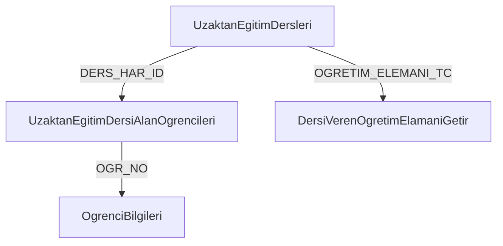

# Hybrid Cache Architecture Documentation

## 📋 Genel Bakış

Bu proje, **Redis + Disk Cache + Database** karma cache stratejisi kullanarak SOAP servis yanıtlarını kalıcı ve performanslı bir şekilde saklar.

## 🏗️ Mimari

### Cache Hierarchy (Katmanlı Cache)

```
┌─────────────────────────────────────────────────────────┐
│                    REST API Request                      │
└─────────────────────────────────────────────────────────┘
                           ↓
┌─────────────────────────────────────────────────────────┐
│  L1: Redis Cache (In-Memory, Volatile)                  │
│  - En hızlı erişim (~1ms)                               │
│  - TTL: Yapılandırılabilir (default: 24 saat)          │
│  - Sunucu restart'ta kaybolur                           │
└─────────────────────────────────────────────────────────┘
                           ↓ (Cache Miss)
┌─────────────────────────────────────────────────────────┐
│  L2: Disk Cache (File-based, Persistent)               │
│  - Orta hızlı erişim (~10ms)                           │
│  - Sunucu restart'ta korunur                           │
│  - Caffeine cache manager                              │
└─────────────────────────────────────────────────────────┘
                           ↓ (Cache Miss)
┌─────────────────────────────────────────────────────────┐
│  L3: Database (H2/PostgreSQL, Fully Persistent)        │
│  - Yavaş erişim (~50ms)                                │
│  - Tam kalıcılık, metadata tracking                    │
│  - LRU, TTL, metrics support                           │
└─────────────────────────────────────────────────────────┘
                           ↓ (Cache Miss)
┌─────────────────────────────────────────────────────────┐
│  Source: SOAP Service (External)                        │
│  - En yavaş (~5-30 saniye)                             │
│  - Network latency, processing time                     │
└─────────────────────────────────────────────────────────┘
```

## 🔄 Cache Stratejileri

### Okuma Stratejisi (Read-Through)

1. **Redis'ten kontrol et** → Varsa döndür (REDIS_HIT)
2. **Disk'ten kontrol et** → Varsa döndür + Redis'e yaz (DISK_HIT)
3. **Database'den kontrol et** → Varsa döndür + Disk ve Redis'e yaz (DATABASE_HIT)
4. **SOAP'tan çek** → Tüm katmanlara yaz (CACHE_MISS)

### Yazma Stratejisi (Write-Through)

Yeni veri geldiğinde **tüm katmanlara** aynı anda yazılır:
- ✅ Redis (hızlı erişim için)
- ✅ Disk (restart koruması için)
- ✅ Database (kalıcılık ve metadata için)

### Cache Promotion

Daha yavaş katmanlardan veri bulunduğunda, üst katmanlara otomatik olarak kopyalanır:
- Database → Disk + Redis
- Disk → Redis

## 🔗 Servis Bağımlılık Yönetimi

### Bağımlılık Zinciri Örneği



### Özellikler

- **Otomatik Bağımlılık Çözümü**: Topological sort ile doğru sıralama
- **Cascade Invalidation**: Bir servis invalidate edildiğinde bağımlıları da invalidate edilir
- **Döngüsel Bağımlılık Kontrolü**: Sonsuz döngü önleme
- **Öncelik Yönetimi**: Kritik bağımlılıklar önce işlenir

## 📊 Cache Metrikleri

### Takip Edilen Metrikler

- **Cache Hit Rate**: Redis, Disk, Database hit oranları
- **Response Time**: Ortalama yanıt süreleri
- **Cache Size**: Toplam cache boyutu
- **Access Count**: Popülerlik analizi
- **SOAP Call Count**: Gerçek servis çağrı sayısı

### Metrik Endpoint'leri

```bash
GET /api/cache-management/statistics
GET /api/cache-management/metrics/recent
GET /api/cache-management/health
```

## ⚙️ Konfigürasyon

### application.properties

```properties
# Redis Configuration
spring.data.redis.host=localhost
spring.data.redis.port=6379
cache.strategy.redis.enabled=true

# Cache TTL (seconds)
cache.ttl.soap-response=86400      # 24 saat
cache.ttl.ders-list=3600           # 1 saat
cache.ttl.ogrenci-list=1800        # 30 dakika

# Disk Cache
cache.disk.directory=./cache
cache.disk.max-size-mb=500

# Database (H2 for dev, PostgreSQL for prod)
spring.datasource.url=jdbc:h2:file:./data/proliz_cache
spring.jpa.hibernate.ddl-auto=update

# Auto Refresh
cache.refresh.auto-enabled=true
cache.refresh.cron=0 0 2 * * ?     # Her gece 2:00
```

## 🔄 Otomatik Cache Yenileme

### Scheduled Tasks

| Task | Sıklık | Açıklama |
|------|---------|----------|
| `markExpiredCaches` | 10 dakika | Süresi dolmuş cache'leri işaretle |
| `refreshPopularCaches` | 1 saat | Popüler cache'leri yenile |
| `cleanupOldCaches` | Gece 2:00 | 30 günden eski cache'leri sil |
| `lruCleanup` | 6 saat | LRU algoritması ile temizlik |
| `healthCheck` | 30 dakika | Cache sağlık kontrolü |
| `refreshDataCache` | Gece 3:00 | Tüm DataCache'i yenile |

## 🚀 Kullanım Örnekleri

### 1. Cache'li SOAP Çağrısı

```java
@Autowired
private OgrenciWebServiceClient soapClient;

// Otomatik cache desteği
String dersler = soapClient.getUzaktanEgitimDersleri();
// İlk çağrı: SOAP'tan çekilir (~10 saniye)
// Sonraki çağrılar: Cache'ten gelir (~1ms)
```

### 2. Cache Invalidation

```bash
# Tek bir cache'i invalidate et
DELETE /api/cache-management/invalidate?cacheKey=soap:UzaktanEgitimDersleri

# Servis metodunun tüm cache'lerini invalidate et
DELETE /api/cache-management/invalidate/service/UzaktanEgitimDersleri

# Cascade invalidation (bağımlılarla birlikte)
DELETE /api/cache-management/invalidate/cascade/UzaktanEgitimDersleri
```

### 3. Bağımlılık Yönetimi

```bash
# Bağımlılıkları listele
GET /api/cache-management/dependencies

# Bağımlılık grafiği
GET /api/cache-management/dependencies/graph

# Bağımlılık zincirini çöz
GET /api/cache-management/dependencies/resolve/UzaktanEgitimDersleri
```

## 📈 Performans İyileştirmeleri

### Öncesi (Cache Yok)
- **İlk yükleme**: ~30-60 dakika
- **Her istek**: 5-30 saniye SOAP çağrısı
- **Sunucu restart**: Tüm veriler kaybolur

### Sonrası (Hybrid Cache)
- **İlk yükleme**: ~30-60 dakika (ilk kez)
- **Cache hit**: ~1-10ms (Redis/Disk)
- **Sunucu restart**: Veriler korunur (Disk + DB)
- **Hit rate**: %85-95 (tipik kullanımda)

## 🛡️ Güvenlik ve Dayanıklılık

### Özellikler

- ✅ **Restart Koruması**: Disk ve DB sayesinde veriler kaybolmaz
- ✅ **Redis Failure Handling**: Redis çökerse Disk ve DB devreye girer
- ✅ **Automatic Recovery**: Katmanlar arası otomatik failover
- ✅ **LRU Eviction**: Bellek dolduğunda en az kullanılanlar silinir
- ✅ **TTL Management**: Otomatik süre dolumu kontrolü
- ✅ **Metrics Tracking**: Performans ve sağlık izleme

## 🔧 Bakım ve Monitoring

### Health Check

```bash
GET /api/cache-management/health
```

**Response:**
```json
{
  "status": "UP",
  "cacheEnabled": true,
  "hitRate": 87.5,
  "totalItems": 1523,
  "healthScore": 95.0
}
```

### İstatistikler

```bash
GET /api/cache-management/statistics
```

**Response:**
```json
{
  "cacheStatistics": {
    "totalCachedItems": 1523,
    "totalCacheSize": 45678912,
    "validCaches": 1450,
    "expiredCaches": 73,
    "totalHits": 12543,
    "totalMisses": 1876,
    "hitRate": "87.00%"
  },
  "dependencyStatistics": {
    "totalDependencies": 3,
    "maxDependencyDepth": 2
  }
}
```

## 🐛 Troubleshooting

### Redis Bağlantı Hatası

```properties
# Redis'i devre dışı bırak
cache.strategy.redis.enabled=false
```

### Disk Cache Temizliği

```bash
# Manuel temizlik
rm -rf ./cache/*
```

### Database Reset

```bash
# H2 database'i sıfırla
rm -rf ./data/proliz_cache.*
```

### Manuel Cache Refresh

```bash
POST /api/cache-management/refresh
```

## 📚 API Endpoints

### Cache Management

| Method | Endpoint | Açıklama |
|--------|----------|----------|
| GET | `/api/cache-management/statistics` | Cache istatistikleri |
| GET | `/api/cache-management/health` | Sağlık kontrolü |
| DELETE | `/api/cache-management/invalidate` | Cache invalidate |
| DELETE | `/api/cache-management/invalidate/service/{method}` | Servis cache invalidate |
| DELETE | `/api/cache-management/invalidate/cascade/{method}` | Cascade invalidate |

### Dependency Management

| Method | Endpoint | Açıklama |
|--------|----------|----------|
| GET | `/api/cache-management/dependencies` | Bağımlılıkları listele |
| GET | `/api/cache-management/dependencies/graph` | Bağımlılık grafiği |
| GET | `/api/cache-management/dependencies/resolve/{method}` | Zincir çözümle |
| POST | `/api/cache-management/dependencies` | Yeni bağımlılık ekle |
| PUT | `/api/cache-management/dependencies/{id}/disable` | Bağımlılığı devre dışı bırak |

### Metrics

| Method | Endpoint | Açıklama |
|--------|----------|----------|
| GET | `/api/cache-management/metrics/recent` | Son 24 saat metrikleri |
| GET | `/api/cache-management/metrics/service/{method}` | Servis metrikleri |

## 🎯 Best Practices

1. **Redis'i Production'da Kullan**: En iyi performans için Redis şart
2. **TTL'leri Ayarla**: Veri güncellik ihtiyacına göre TTL belirle
3. **Metrikleri İzle**: Hit rate %80'in altına düşerse stratejiyi gözden geçir
4. **Disk Boyutunu Kontrol Et**: Düzenli LRU cleanup yapılsın
5. **Bağımlılıkları Güncel Tut**: Servis değişikliklerinde bağımlılıkları güncelle
6. **Cascade Invalidation Kullan**: İlişkili verileri birlikte invalidate et

## 🔮 Gelecek İyileştirmeler

- [ ] Redis Cluster desteği
- [ ] Distributed cache invalidation (multi-instance)
- [ ] Cache warming stratejisi
- [ ] Predictive cache refresh (ML-based)
- [ ] Cache compression
- [ ] Multi-region cache replication

## 📞 Destek

Sorularınız için:
- GitHub Issues: [Repository Link]
- Email: dev@proliz.edu.tr
